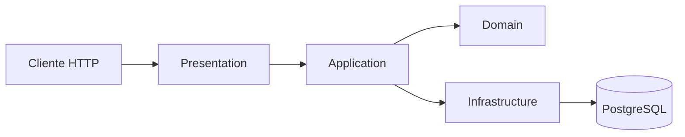

# Kanban API

API REST para gerenciar responsáveis, projetos e transições de um quadro Kanban. Status e métricas temporais são derivados das datas, evitando dados persistidos que ficam desatualizados com o tempo.

## Stack

- Java 21, Spring Boot 3.5.16 e Maven Wrapper 3.9.11
- Spring Web, Data JPA, Validation, Actuator e springdoc-openapi
- PostgreSQL 17.11, Flyway, JUnit 5, MockMvc e Testcontainers
- Docker Compose e GitHub Actions

## Arquitetura

Monólito em camadas pragmáticas: apresentação expõe HTTP; aplicação coordena casos de uso; domínio concentra regras; infraestrutura trata persistência e configuração.



Veja o [diagrama detalhado](docs/architecture.md) e os [ADRs](docs/adr).

## Estrutura de diretórios

```text
src/main/java/br/com/alvar/kanban/
├── domain/          # entidades, regras e exceções
├── application/     # serviços, DTOs e mapeadores
├── infrastructure/  # repositórios e configuração
└── presentation/    # controllers, erros HTTP e paginação
src/main/resources/db/migration/ # schema Flyway
src/test/java/                    # testes unitários e de integração
docs/                             # plano, ADRs, diagrama e Postman
```

## Modelo de domínio

`Responsible` possui nome, e-mail normalizado e único, cargo e secretaria. `Project` possui nome, datas previstas/realizadas e um ou mais responsáveis. A relação é N:N por `projectResponsibles`; excluir projeto preserva responsáveis e excluir responsável vinculado retorna conflito.

Status, dias de atraso e percentual restante são calculados. Datas previstas podem ser nulas; quando um par existe, o término não pode anteceder o início. Datas realizadas futuras são rejeitadas.

## Regras de status

Precedência:

1. `CONCLUIDO`: término realizado preenchido.
2. `ATRASADO`: sem conclusão e início previsto vencido sem início realizado, ou término previsto vencido.
3. `EM_ANDAMENTO`: início realizado, término realizado vazio e término previsto hoje ou depois.
4. `A_INICIAR`: demais casos.

O dia atual vem de `Clock`, com `America/Fortaleza` como padrão. O texto exige término previsto maior que hoje, mas não define um estado para projeto iniciado no próprio dia do prazo. A implementação considera esse projeto em andamento durante todo o dia e o classifica como atrasado no dia seguinte. Projeto iniciado sem término previsto é rejeitado. Dias de atraso contam dias corridos após o término previsto. O percentual restante usa duas casas, `HALF_UP` e limite 0..100.

## Transições

`PATCH /api/kanban/projects/{id}/status` recebe `targetStatus`. O serviço calcula a origem, aplica o efeito e confirma se as datas produzem o destino. Mesmo status é idempotente; incompatibilidade retorna `422` sem persistir efeitos.

- Para `CONCLUIDO`, preenche término realizado com hoje.
- `CONCLUIDO -> A_INICIAR` não altera datas automaticamente: orienta a edição explícita do término realizado e das datas previstas.
- De `CONCLUIDO` para `EM_ANDAMENTO` ou `ATRASADO`, remove término realizado e valida o resultado.
- `A_INICIAR -> EM_ANDAMENTO` preenche início realizado com hoje.
- `EM_ANDAMENTO -> A_INICIAR` remove início realizado.
- Destinos dependentes de atraso não fabricam datas; o erro orienta o ajuste necessário.

As doze combinações entre estados diferentes têm cobertura unitária.

## Decisões técnicas

- Status não é persistido porque pode mudar à meia-noite sem escrita.
- Flyway altera o schema; Hibernate usa `ddl-auto=validate`.
- Filtros rodam no PostgreSQL antes da paginação.
- DTOs separam o contrato HTTP das entidades.
- A data de referência é capturada uma vez por operação.

Consulte [ADR 001](docs/adr/001-derivedStatusAndClock.md) e [ADR 002](docs/adr/002-relationalPersistence.md).

## Execução local

Pré-requisitos: JDK 21 e Docker. Maven global não é necessário.

```bash
docker compose up -d --wait postgres
./mvnw spring-boot:run
```

No PowerShell, use `.\mvnw.cmd`. O padrão local usa `localhost:5433`, banco/usuário `kanban` e senha `kanbanLocal`. Podem ser definidos `DATABASE_URL`, `DATABASE_USERNAME`, `DATABASE_PASSWORD` e `APP_TIME_ZONE`.

## Docker

```bash
docker compose up --build --wait
docker compose ps
docker compose down
```

A API fica em `http://localhost:8080`; o PostgreSQL, em `127.0.0.1:5433`. `.env.example` documenta opções e `.env` não é versionado. O volume `postgresData` preserva dados. A imagem usa build multi-stage, JRE 21, usuário sem privilégios e healthcheck.

## Testes

```bash
./mvnw verify
```

Executa 70 testes unitários e 44 testes de integração/API. A integração usa PostgreSQL 17.11 descartável via Testcontainers e valida migrations, constraints, transações, filtros, paginação e contratos HTTP. Docker precisa estar ativo. Relatórios ficam em `target/surefire-reports` e `target/failsafe-reports`.

## Swagger

- UI: `http://localhost:8080/swagger-ui`
- OpenAPI: `http://localhost:8080/api-docs`
- Saúde: `http://localhost:8080/actuator/health`

## Endpoints e exemplos

| Método | Rota | Função |
| --- | --- | --- |
| `POST`, `GET` | `/api/responsibles` | Criar e listar responsáveis |
| `GET`, `PUT`, `DELETE` | `/api/responsibles/{id}` | Consultar, editar e excluir |
| `POST`, `GET` | `/api/projects` | Criar e listar projetos |
| `GET`, `PUT`, `DELETE` | `/api/projects/{id}` | Consultar, editar e excluir |
| `GET` | `/api/kanban/projects?status=ATRASADO` | Listar uma coluna |
| `PATCH` | `/api/kanban/projects/{id}/status` | Transicionar projeto |
| `GET` | `/api/indicators/projects-by-status` | Contar por status |

Listagens aceitam `page`, `size` e `sort`. Projetos também aceitam `status`, `responsibleId`, `department` e `text` combináveis.

```bash
curl -X POST http://localhost:8080/api/responsibles -H "Content-Type: application/json" -d '{"name":"Ana Silva","email":"ana@example.com","role":"Gerente","department":"Planejamento"}'
curl -X POST http://localhost:8080/api/projects -H "Content-Type: application/json" -d '{"name":"Reforma da escola","responsibleIds":[1],"plannedStartDate":"2026-10-01","plannedEndDate":"2026-12-20"}'
curl -X PATCH http://localhost:8080/api/kanban/projects/1/status -H "Content-Type: application/json" -d '{"targetStatus":"EM_ANDAMENTO"}'
```

Importe a [coleção Postman](docs/api/kanban-api.postman_collection.json) para executar o fluxo completo.

## Banco de dados

As migrations criam o schema `kanban`, `responsibles`, `projects`, `projectResponsibles`, constraints e índices para vínculo, secretaria e datas usadas nos filtros de status. O histórico Flyway fica em `public.flyway_schema_history`. Auditoria usa `Instant`; cronograma usa `LocalDate`; projetos possuem versão otimista. A busca por substring não recebe B-tree, pois consultas `%texto%` não aproveitam esse tipo de índice.

## Limitações

- Sem autenticação/autorização e catálogo próprio de secretarias.
- Indicador executa quatro contagens; grande volume pode pedir uma consulta agregada.
- Métricas concluídas retornam zero e não representam atraso histórico.
- Actuator expõe somente o healthcheck básico.

## Próximos passos

- Autenticação por perfis e auditoria de negócio.
- CRUD de secretarias e filtros por identificador.
- Métricas históricas, Prometheus e testes de carga.

## Diferenciais implementados

- Filtros combináveis com paginação correta no banco.
- Indicador de projetos por status.
- OpenAPI com exemplos e erros; Docker com healthchecks e usuário restrito.
- CI Java 21; regras temporais determinísticas por `Clock`; ADRs e diagramas.

O processo assistido está documentado em [AI_USAGE.md](AI_USAGE.md).
