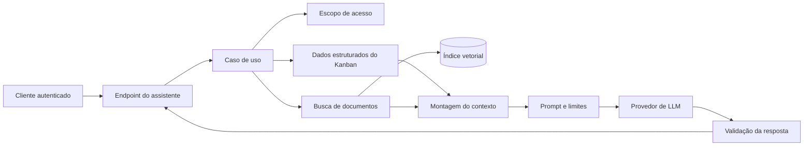

# ADR 003: assistente de projetos com contexto controlado

Status: proposta arquitetural; não implementada.

## Contexto

O Kanban reúne cronograma, responsáveis, secretaria, estado derivado, percentual de tempo restante e dias de atraso. Esses dados permitem apoiar gestores na priorização de projetos e na identificação de riscos, mas uma resposta gerada por modelo de linguagem não pode substituir as regras determinísticas do domínio nem alterar projetos sem decisão humana.

O objetivo desta proposta é oferecer um assistente consultivo que responda perguntas como "quais projetos exigem atenção nesta semana?" e explique suas recomendações com base nos dados acessíveis ao usuário. A API atual continua sendo a fonte oficial; o modelo apenas interpreta um contexto previamente selecionado.

## Decisão

Adicionar futuramente um caso de uso isolado na camada de aplicação. Ele consulta os serviços e repositórios existentes, monta um contexto estruturado e chama um provedor de LLM por uma porta de saída. A infraestrutura implementa o cliente do provedor. O controller expõe somente o contrato HTTP e não contém prompts nem regras de priorização.



O fluxo recupera primeiro os projetos autorizados e calcula status e métricas usando as políticas atuais. Se houver documentos de apoio, como normas internas ou atas, uma busca semântica recupera apenas trechos relacionados à pergunta e às secretarias permitidas. O contexto enviado ao modelo contém:

- pergunta do usuário e data de referência;
- projetos autorizados, identificados por ID, com datas, status e métricas já calculadas pela aplicação;
- responsáveis e secretarias estritamente necessários à resposta;
- trechos documentais com identificador, versão e origem;
- instruções para não inventar dados, citar as fontes e declarar quando o contexto for insuficiente.

Dados calculáveis, como status, atraso e percentual restante, não são delegados ao modelo. A aplicação limita quantidade e tamanho dos registros, ordena os projetos por critérios determinísticos e remove campos desnecessários antes da chamada. Isso reduz custo, exposição de dados e variação da resposta.

## Contrato proposto

```http
POST /api/ai/project-assistant
Content-Type: application/json
```

```json
{
  "question": "Quais projetos precisam de atenção nesta semana?",
  "filters": {
    "department": "Planejamento",
    "status": ["ATRASADO", "EM_ANDAMENTO"]
  },
  "maxProjects": 20
}
```

Resposta de sucesso:

```json
{
  "answer": "Dois projetos merecem atenção imediata...",
  "recommendations": [
    {
      "projectId": 42,
      "priority": "HIGH",
      "reason": "O projeto está atrasado há 8 dias."
    }
  ],
  "sources": [
    {
      "type": "PROJECT",
      "reference": "42"
    },
    {
      "type": "DOCUMENT",
      "reference": "norma-priorizacao:v3#section-4"
    }
  ],
  "generatedAt": "2026-09-23T15:00:00Z"
}
```

O endpoint retorna `400` para pergunta ou filtros inválidos, `401`/`403` para ausência de autenticação ou acesso, `422` quando não há contexto suficiente para uma resposta útil, `429` quando o limite de uso é excedido e `503` quando o provedor permanece indisponível. A resposta nunca executa transições nem atualiza datas; uma recomendação precisa ser confirmada nos endpoints normais do Kanban.

## Falhas e resiliência

A chamada ao provedor terá timeout curto e configurável. Uma nova tentativa será permitida somente para falhas transitórias e com backoff e jitter; timeouts não serão repetidos indefinidamente. Circuit breaker interrompe chamadas quando o provedor apresenta falhas sucessivas, e bulkhead limita a concorrência para preservar a API principal.

Se o provedor falhar, o endpoint retorna `503` com erro específico e identificador de rastreamento. Como evolução, um fallback determinístico pode listar projetos atrasados e suas métricas sem produzir texto generativo. Esse fallback deve ser identificado no contrato para o cliente não confundi-lo com uma resposta do modelo.

A saída do provedor deve seguir schema estruturado. A aplicação rejeita IDs que não estavam no contexto, referências inexistentes e formatos inválidos. Nenhuma resposta parcial é persistida como dado de negócio.

## Segurança, privacidade e observabilidade

Autenticação e autorização devem existir antes da disponibilização do recurso. O recorte por usuário e secretaria ocorre antes da recuperação e antes da montagem do prompt. Documentos também recebem metadados de acesso para impedir que a busca vetorial atravesse escopos.

Prompts não devem conter segredos, credenciais nem dados pessoais sem necessidade. Logs registram duração, provedor, modelo, quantidade de tokens, IDs das fontes, resultado da validação e código de erro; pergunta e resposta completas exigem política explícita de retenção e mascaramento. Instruções presentes em documentos são tratadas como conteúdo, evitando que prompt injection altere as regras do sistema.

As métricas incluem latência, taxa de timeout, custo por requisição, respostas recusadas, fontes utilizadas e avaliação dos usuários. Um conjunto versionado de perguntas e respostas esperadas mede fundamentação, precisão das referências e utilidade antes de trocar modelo ou prompt.

## Trade-offs e alternativas

Um prompt simples com dados estruturados é a primeira etapa recomendada: custa menos, é fácil de observar e atende perguntas sobre o estado atual. RAG passa a fazer sentido quando documentos externos influenciam a decisão; ele melhora a fundamentação, mas adiciona indexação, controle de acesso, atualização de embeddings e risco de recuperar contexto irrelevante.

Fine-tuning não é a escolha inicial. Ele pode ajustar formato e estilo, mas não mantém fatos operacionais atualizados e exige conjunto de treino, avaliação e ciclo de manutenção. Consultar diretamente o banco pelo modelo também foi descartado porque amplia permissões, dificulta prever custo e pode contornar regras de domínio.

Manter o assistente consultivo reduz o risco operacional e preserva a rastreabilidade, ao custo de exigir confirmação humana. Usar um provedor externo acelera a entrega, mas cria custo variável, dependência e questões de residência de dados; uma porta de saída permite substituir o provedor sem contaminar aplicação e domínio.

## Evolução proposta

1. Introduzir autenticação, autorização e auditoria na API.
2. Implementar perguntas sobre dados estruturados, com resposta validada e sem RAG.
3. Executar avaliação offline e liberar para um grupo restrito com limites de uso.
4. Adicionar RAG somente quando houver documentos relevantes, versionados e com regras de acesso.
5. Comparar qualidade, latência e custo antes de ampliar o escopo.

Esta decisão não altera o comportamento atual da API. Ela documenta uma evolução possível e os controles necessários para que uma camada de IA seja segura, observável e subordinada às regras do Kanban.
