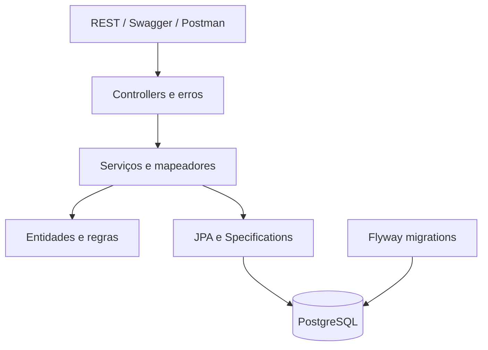
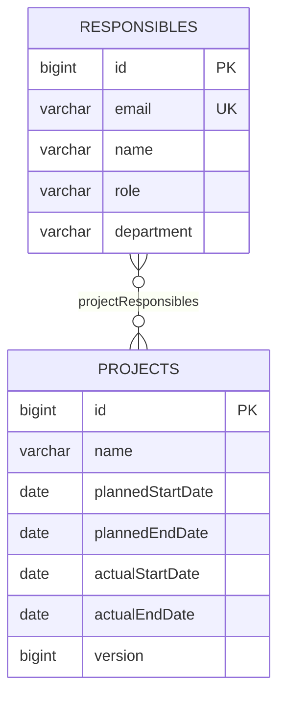

# Diagrama de arquitetura

O domínio calcula status, métricas e transições sem depender de Spring. A aplicação define transações, carrega entidades e captura a data de referência. Specifications traduzem status para SQL, preservando filtros e totais antes da paginação.

